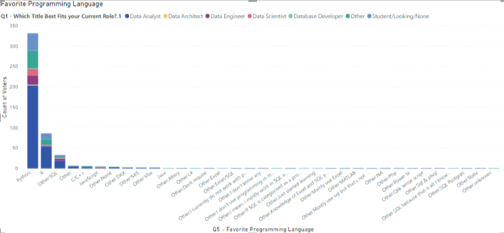
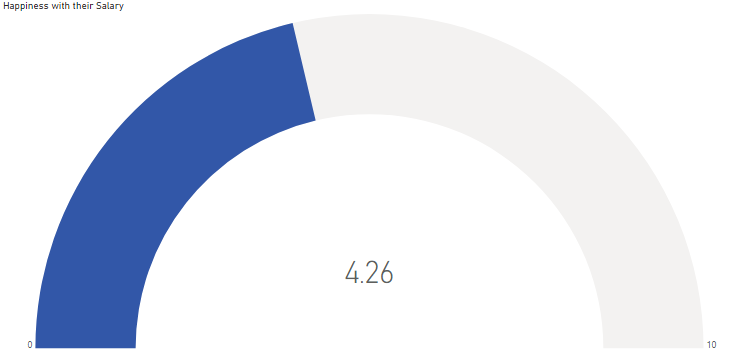

# Data-Professional-Survey-Analysis
"Data Professional Survey Analysis" is a Power BI project that analyzes data gathered from professionals, including salary, job title, country, work/life balance, happiness with salary, gender, age, favorite programming language, etc., presenting key insights through various visualizations.

## Overview
The Data Professional Survey project aims to analyze various aspects of professionals' data, including salary, job title, country, work/life balance, happiness with salary, gender, age, favorite programming language, etc. The project utilizes Power BI for data visualization and analysis.

## Features
* Calculated average salary by job title and visualized it in a stacked bar chart.
* Counted the number of professionals from each country and visualized it in tree maps.
* Counted the favorite programming languages among professionals and visualized it in a stacked column chart.
* Counted the data and visualized it in a donut chart.
* Calculated the percentage of professionals happy with their work/life balance and visualized it in a gauge chart.
* Calculated the percentage of professionals happy with their salary and visualized it in a gauge chart.

## Usage
To run the Power BI project:

* Open Power BI Desktop.
* Load the provided dataset containing information about professionals.
* Create the required calculated measures for average salary, happiness with work/life balance, etc.
* Create visualizations based on the features mentioned above.
* Customize the visualizations as needed.
* Save the project.
 
## Data Source
The data for this project was gathered from a survey conducted among data professionals. It includes information such as salary, job title, country, work/life balance, happiness with salary, gender, age, favorite programming language, etc.

## Visualizations
* Stacked bar chart: Displays the average salary by job title.

* Tree maps: Shows the distribution of professionals across different countries.

  
* Stacked column chart: Illustrates the count of favorite programming languages.

 
* Donut chart: Represents the count of data professionals.

  
* Gauge charts: Visualizes the percentage of professionals happy with their work/life balance.

Gauge charts: Visualizes the percentage of professionals happy with their salary.

 
## Final Report Dashboard
A comprehensive report summarizing the findings and visualizations of the Data Professional Survey project is available. It provides insights into various aspects of data professionals' lives and preferences.

## Contributors
Siri S
